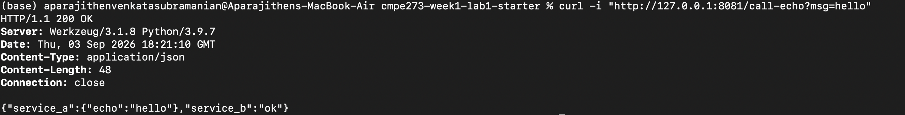
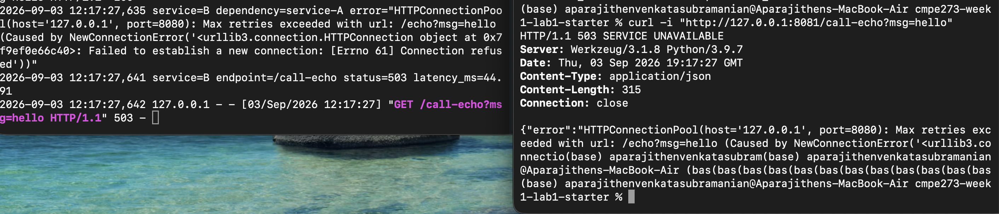

# CMPE 273 – Week 1 Lab 1: Your First Distributed System

## Implementation

I completed the `python-http` track using Flask and the Python `requests`
library.

The project contains two independently running services:

- **Service A** runs on port `8080`.
- **Service B** runs on port `8081` and calls Service A over HTTP.

## API Endpoints

| Service | Endpoint | Description |
|---|---|---|
| Service A | `GET /health` | Returns Service A's health status |
| Service A | `GET /echo?msg=hello` | Returns the supplied message |
| Service B | `GET /health` | Returns Service B's health status |
| Service B | `GET /call-echo?msg=hello` | Calls Service A's echo endpoint |

## How to Run Locally

### Prerequisites

- Python 3.10 or later
- Git
- `pip`

### 1. Clone the repository

```bash
git clone https://github.com/SuprithaMallaradhya/cmpe273-week1-lab1-starter.git
cd cmpe273-week1-lab1-starter
```

### 2. Create a virtual environment

```bash
python3 -m venv .venv
source .venv/bin/activate
```

### 3. Install dependencies

```bash
pip install -r python-http/service-a/requirements.txt
pip install -r python-http/service-b/requirements.txt
```

### 4. Start Service A

Open the first terminal:

```bash
source .venv/bin/activate
python python-http/service-a/app.py
```

Service A runs at `http://127.0.0.1:8080`.

### 5. Start Service B

Open a second terminal:

```bash
source .venv/bin/activate
python python-http/service-b/app.py
```

Service B runs at `http://127.0.0.1:8081`.

## Health Checks

After starting both services, I verified that each service was running
independently.

### Service A Health Check

```bash
curl -i "http://127.0.0.1:8080/health"
```

### Actual response

```text
curl -i "http://127.0.0.1:8080/health"
HTTP/1.1 200 OK
Server: Werkzeug/3.1.8 
Date: Thu, 03 Sep 2026 18:18:54 GMT
Content-Type: application/json
Content-Length: 16
Connection: close

{"status":"ok"}
```

Expected response body:

```json
{"status":"ok"}
```

### Service B Health Check

```bash
curl -i "http://127.0.0.1:8081/health"
```

### Actual response

```text
curl -i "http://127.0.0.1:8081/health"
HTTP/1.1 200 OK
Server: Werkzeug/3.1.8 Python/3.9.7
Date: Thu, 03 Sep 2026 18:20:58 GMT
Content-Type: application/json
Content-Length: 16
Connection: close

{"status":"ok"}
```

Expected response body:

```json
{"status":"ok"}
```

### Health-check logs

```text
2026-09-03 11:18:54,532 service=A endpoint=/health status=200 latency_ms=0.40
2026-09-03 11:20:58,612 service=B endpoint=/health status=200 latency_ms=2.18
```

## Successful Communication

With both services running, I executed:

```bash
curl -i "http://127.0.0.1:8081/call-echo?msg=hello"
```

### Actual response

```text
curl -i "http://127.0.0.1:8081/call-echo?msg=hello"
HTTP/1.1 200 OK
Server: Werkzeug/3.1.8 
Date: Thu, 03 Sep 2026 18:21:10 GMT
Content-Type: application/json
Content-Length: 48
Connection: close

{"service_a":{"echo":"hello"},"service_b":"ok"}
```

### Actual logs

```text
2026-09-03 11:20:04,770 127.0.0.1 - - [03/Sep/2026 11:20:04] "GET /echo?msg=hello HTTP/1.1" 200 -
2026-09-03 11:21:10,595 service=A endpoint=/echo status=200 latency_ms=0.90

2026-09-03 11:20:58,616 127.0.0.1 - - [03/Sep/2026 11:20:58] "GET /health HTTP/1.1" 200 -
2026-09-03 11:21:10,598 service=B endpoint=/call-echo status=200 latency_ms=84.69
```

### Success screenshot



## Independent Failure Demonstration

I stopped Service A using `Ctrl+C` while keeping Service B running. I then
executed the same request:

```bash
curl -i "http://127.0.0.1:8081/call-echo?msg=hello"
```

Service B remained running but returned HTTP `503` because Service A was
unavailable.

### Actual response

```text
curl -i "http://127.0.0.1:8081/call-echo?msg=hello"
HTTP/1.1 503 SERVICE UNAVAILABLE
Server: Werkzeug/3.1.8 Python/3.9.7
Date: Thu, 03 Sep 2026 19:17:27 GMT
Content-Type: application/json
Content-Length: 315
Connection: close

{"error":"HTTPConnectionPool(host='127.0.0.1', port=8080): Max retries exceeded with url: /echo?msg=hello (Caused by NewConnectionError('<urllib3.connection.HTTPConnection object at 0x7f9ef0e66c40>: Failed to establish a new connection: [Errno 61] Connection refused'))","service_a":"unavailable","service_b":"ok"}

```

### Actual Service B error log

```text
2026-09-03 12:17:27,635 service=B dependency=service-A error="HTTPConnectionPool(host='127.0.0.1', port=8080): Max retries exceeded with url: /echo?msg=hello (Caused by NewConnectionError('<urllib3.connection.HTTPConnection object at 0x7f9ef0e66c40>: Failed to establish a new connection: [Errno 61] Connection refused'))"
2026-09-03 12:17:27,641 service=B endpoint=/call-echo status=503 latency_ms=44.91
```

### Failure screenshot



## Logging

Every request is logged with the following information:

- Service name
- Endpoint
- HTTP status code
- Request latency in milliseconds

Service B also logs the dependency error when Service A cannot be reached.

## Timeout Handling

Service B uses a one-second timeout when calling Service A. If Service A does
not respond within one second, Service B stops waiting, logs the error, and
returns HTTP `503 Service Unavailable`.

When Service A is completely stopped, the operating system may refuse the
connection immediately instead of waiting for the full timeout. Service B
handles both connection errors and timeout errors.


## What Makes This Distributed?

This application is distributed because Service A and Service B run as separate
processes and communicate over HTTP. They can start, stop, and fail
independently. When Service A is unavailable, Service B continues running but
returns a `503 Service Unavailable` response because its dependency cannot be
reached. This demonstrates network communication, timeout handling, and partial
failure.